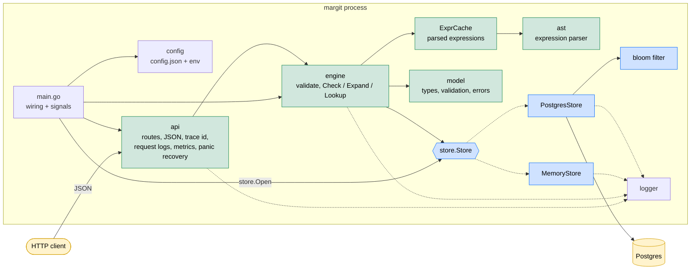
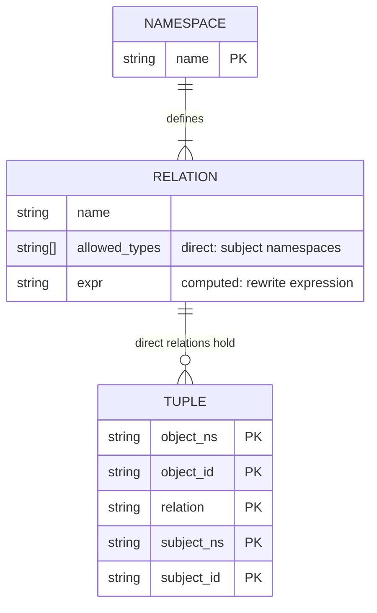
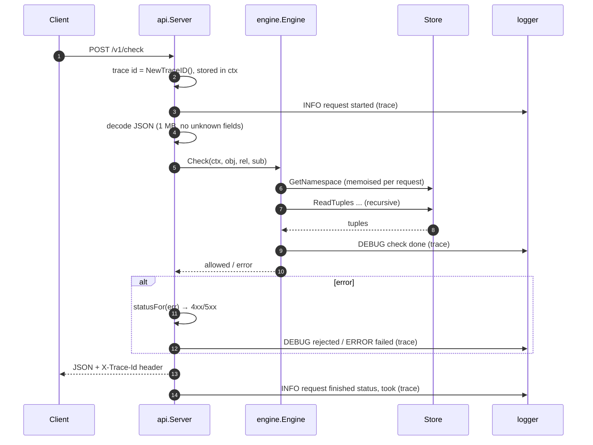
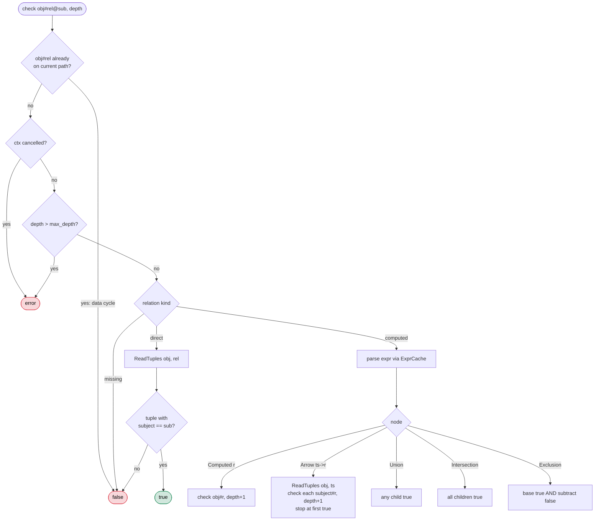
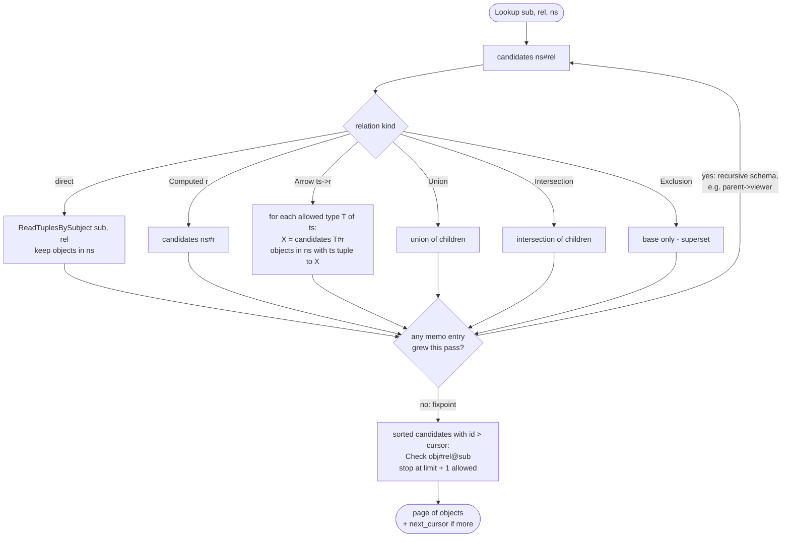
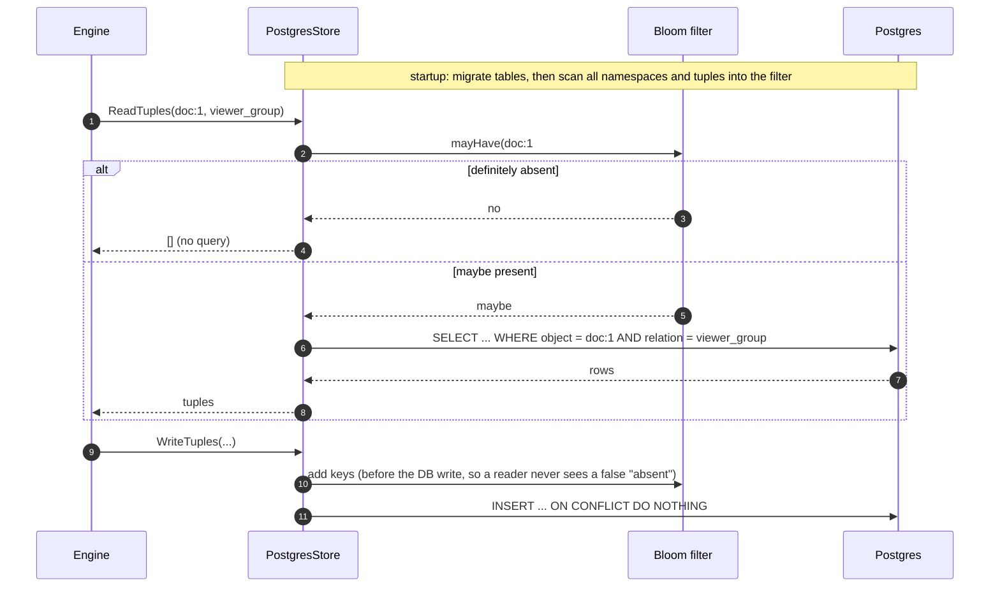
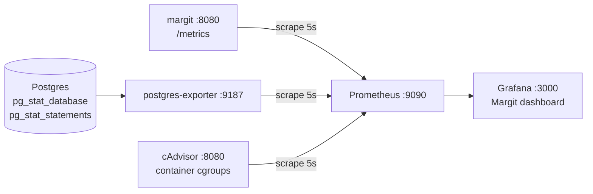

# Margit architecture

Margit answers *"does subject S have relation R on object O?"* by evaluating a namespace schema
over stored relationship tuples, in the style of Google Zanzibar.

## Components



Dependencies point downward only: `api → engine → store → model → ast`. `config` imports the
config structs of `api`, `engine` and `store`, so those packages never import `config`.

| Package | Responsibility |
|---|---|
| `api` | HTTP routing, request decoding (1 MB, strict fields), error → status mapping, trace id, start/finish logs |
| `engine` | Validation policy and graph evaluation; per-request namespace memo and cycle tracking |
| `store` | Persistence behind one interface; memory (maps + RWMutex) or Postgres (pgx pool + bloom filter) |
| `model` | `Entity`, `Namespace`, `Relation`, `RelationTuple`, schema/tuple validation, `model.Error` enum |
| `ast` | Lexer and parser for relation expressions |
| `logger` | Leveled line logger; tag, package and trace id on every line |
| `cmd/tagger` | Build-time tool that fills `"0000"` log tags with unique `tag_xxxxxx` ids |

## Data model



A relation is either **direct** (has `allowed_types`; tuples are written for it) or **computed**
(has `expr`; derived at query time). Expressions combine:

| Node | Syntax | Meaning |
|---|---|---|
| Computed | `owner` | same object, other relation |
| Arrow | `parent->viewer` | follow `parent` tuples, then evaluate `viewer` on each subject |
| Union | `a + b` | either |
| Intersection | `a & b` | both |
| Exclusion | `a - b` | `a` and not `b` |

Postgres layout: `namespaces(name PK, relations JSONB)` and
`relation_tuples(object_ns, object_id, relation, subject_ns, subject_id)` with the full row as
primary key (forward lookups) and an index on `(subject_ns, subject_id, relation)` (reverse lookups).

## Validation policy

Validation happens at write time so reads stay cheap.

| Operation | Validated |
|---|---|
| `SaveNamespace` | Identifiers, relation kind, referenced namespaces/relations exist, arrow tuplesets are direct, no computed cycles |
| `DeleteNamespace` | Rejected (409) if another namespace lists it in `allowed_types` |
| `WriteTuples` | Every tuple against its namespace: relation exists, is direct, subject type allowed. One bad tuple rejects the batch |
| `DeleteTuples` | Syntax only |
| `Check` / `Expand` / `Lookup` | Query syntax and that the top-level namespace/relation exist. References that disappear mid-evaluation count as empty |

## Request lifecycle



A panic in a handler is recovered in the same deferred block, logged with its stack, and turned into
a 500 response. The trace id is only in `ctx`; every log call takes `ctx`, so every line from the
request carries it.

## Check

Depth-first and short-circuiting. State lives in a per-request struct, so concurrent requests share
nothing except the store and the expression cache.



**Expand** walks the same tree but builds sets: union = merge, intersection = retain,
exclusion = remove. Results are sorted by `namespace:id`.

## Lookup

"Which objects of namespace N does subject S have relation R on?" Running Check on every object
would be too slow, so Lookup works backwards from the subject, then confirms each candidate.



Candidates are a **superset**: exclusion keeps only its base, and intersections combine supersets.
The final Check filters it down. Recursive schemas such as nested folders are handled by memoising each
`(namespace, relation)` result and repeating the pass until nothing changes.

Lookup is paginated with a keyset cursor on object id. Candidates are sorted, those with id
`<= cursor` are skipped, and the per-candidate Check stops once `limit + 1` objects are allowed. The
extra object only signals that another page exists, and `next_cursor` is the last returned id. The
candidate pass still runs in full on every page; only the Check phase is cut short. Writes between
pages do not cause duplicates, but objects added before the cursor are not seen. `limit` 0 uses
`engine.lookup_default_limit`, larger values are capped at `engine.lookup_max_limit`, and negative
values are rejected.

## Postgres store and bloom filter

The Postgres store keeps an in-process bloom filter of namespace names, `namespace#relation` pairs,
`(object, relation)` pairs and `(subject, relation)` pairs. A negative answer is definite, so many
lookups for missing data (common in deep checks) skip the database entirely.



Deletes leave keys in the filter (bloom filters cannot remove entries); that only costs an extra
query. `bloom_expected: 0` disables the filter.

## Logging and tracing

```
2026-10-06T16:39:39.887+05:30 WARN  tag=tag_odelzx pkg=engine trace=bcb7575e... msg="tuple rejected" tuple=doc:3#owner@group:eng
```

- **trace**: generated per HTTP request (and once for startup), carried in `context.Context`,
  returned as `X-Trace-Id`. Lines from concurrent requests interleave in the file; filter on `trace=`.
- **tag**: unique per call site, written into the source by `cmd/tagger` (any function whose second
  parameter is named `tag` is a tag site). New code uses `"0000"`; the build fills it in and
  `tagger -check` fails on missing or duplicate tags.
- **pkg**: derived from the caller via `runtime.Caller`.
- Each line is formatted outside the lock and written with a single locked write, so lines never
  tear.

## Metrics and dashboards

`GET /metrics` exposes Prometheus metrics. It is served before the trace/logging middleware, so
scrapes don't produce log lines. Each `Server` has its own registry.

| Metric | Labels |
|---|---|
| `margit_http_requests_total` | `method`, `route` (mux pattern, e.g. `/v1/namespaces/{name}`; `unmatched` otherwise), `status` |
| `margit_http_request_duration_seconds` | `method`, `route` (histogram, 100 µs – 10 s buckets) |
| `margit_http_requests_in_flight` | — |
| `margit_check_results_total` | `allowed` |
| `go_*`, `process_*` | Go runtime and process (CPU, RSS) |

Routes use the pattern rather than the raw path, so label cardinality stays fixed.



The compose stack provisions the Prometheus data source and the `Margit` dashboard
(`docker/grafana/dashboards/margit.json`). Panels cover traffic, errors, check decisions, latency
percentiles and CPU/memory against the 1 CPU / 1 GiB container budget. A Containers row shows CPU and
memory per compose service from cAdvisor (relabelled to `service`). A Postgres row shows
connections, transactions/s, buffer cache hit ratio, block reads, DB size, and statements/s and mean
execution time per SQL statement (a custom exporter query over `pg_stat_statements`, labelled by
normalized query text).

## Known limitations

| Area | Limitation |
|---|---|
| Multiple instances | Each process has its own bloom filter; writes from another instance are not added to it, so it can wrongly deny. Run one writer, or disable the filter (`bloom_expected: 0`). |
| Consistency | No snapshot tokens ("zookies"); a read sees whatever the store has committed. |
| Schema changes | Updating a namespace does not check whether other namespaces' arrows still resolve; missing references evaluate as empty. Deleting a namespace keeps its tuples. |
| Lookup cost | The candidate pass grows with fixpoint passes and candidate count and runs in full on every page; no pagination on Expand. |
| Deep negative checks | Check has no per-request memo of `(object, relation, subject)`. Schemas where several relations each recurse through `parent` (Drive `viewer`/`editor`/`owner`) re-walk the chain, so negative checks cost ~O(d³) reads: 1,130 at d=16, 22,049 at d=48 (5.6 s). Positive checks short-circuit and stay linear. |
| Round trips | Each tuple read is one SQL query (~25 per Drive check); latency is round-trip bound rather than I/O bound. |
| Security | No authentication or rate limiting on the HTTP API. |
